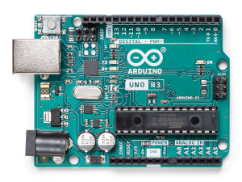
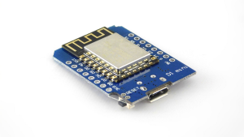
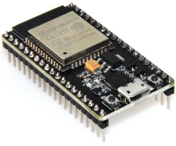

# Arduino Background
TAPO. 2022-03-20.

# Many meanings of "Arduino"

* The company
* The language
* The IDE
* The boards and clones
* The idea

# The Arduino Company
https://www.arduino.cc/

* Produces and sells Arduino boards
* Develops the Arduino IDE
* Books, training material about Arduino.

Make sure to support them!


# Arduino Language

Based on [Processing](https://processing.org/) a language for learning to code though visual arts.
A program is called a "Sketch" and contains a `setup()` function run once and a `loop()` function that is repeated perpetually after the setup.
The syntax is C++.

```arduino
# define LED_PIN 13                  // Pin number attached to LED.

void setup() {
    pinMode(LED_PIN, OUTPUT);       // Configure pin 13 to be a digital output.
}

void loop() {
    digitalWrite(LED_PIN, HIGH);    // Turn on the LED.
    delay(1000);                    // Wait 1 second (1000 milliseconds).
    digitalWrite(LED_PIN, LOW);     // Turn off the LED.
    delay(1000);                    // Wait 1 second.
}
```

Together with the IDE it makes programming microcontrollers accessible.

Hardware is suppoted by loading "Board definitions" in the "Board manager".

# Arduino IDE
Download from : https://www.arduino.cc/en/software

- Arduino IDE 1.8.19 Based on Processing IDE
	- https://github.com/arduino/Arduino/
- Arduino IDE 2.0 RC Based on [Theia](https://theia-ide.org/) written in [Electron](https://www.electronjs.org/). Looks like Atom, VSCode etc.
    - https://github.com/arduino/arduino-ide
- Arduino Web editor: https://create.arduino.cc/editor/

## Features of the IDE

Tasks supported by the IDE:

* Manage board definitions
* Manage libraries
* Compile the program
* Upload program to board
* Display serial monitor

It also has:

* Examples folder
  - Standard examples (LED, web-server etc)
  - Board specific examples (eg ESP32cam)
  - Library examples (eg library for morse code)

# Aduino Boards

Open source hardware: you can build it yourself!
Most people buy a pre-build one.

Most original Arduino boards use Amtel 8-bit ATmega microcontrollers:

- Arduino Uno (20€), (40€ w wifi): ATmega328P @ 16MHz. 32 k flash, 2k RAM
- Arduino Mega (35€): ATmega2560
- Arduino Nano (18€): ATmega328 
- Arduino Due (35€): ARM Cortex-M3



## Arduino derivatives

https://en.wikipedia.org/wiki/List_of_Arduino_boards_and_compatible_systems

Popular alternatives ar emade by Chinese Espressif:

* ESP8266 (2€ w usb, wifi): L106 32-bit RISC microprocessor @ 80 MHz
  - 32k instruction RAM
  - 80k user-data RAM
* ESP32 (5€ w usb, wifi, bluetooth): Xtensa dual-core 32-bit LX6 microprocessor @ 160 MHz
  - 320k RAM
  - input is 5V (usb), but all pins are 3.3V




## Shields / Hats

* Adds functionality like USB, ethernet, wifi, sensors
* Connects on top of the board


## Adafruit

https://www.adafruit.com/

Makes lots of sensors available for use with Arduino-compatible boards.


# Sources

* [Wikipedia](https://en.wikipedia.org/wiki/Arduino)
* Arduino website https://www.arduino.cc/en/about
* Massimo Banzi: "Getting Started with Arduino"
